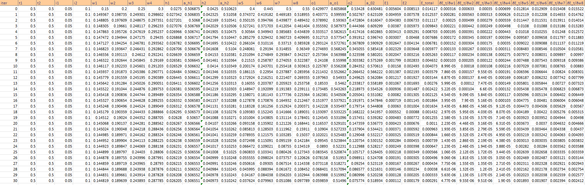
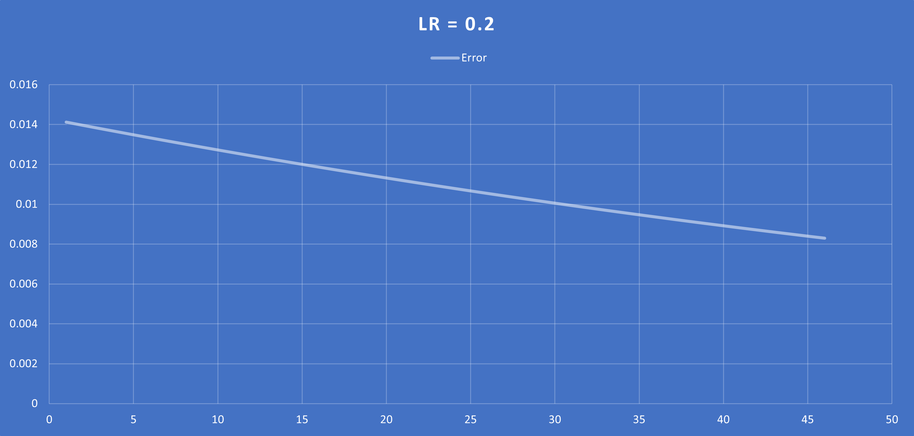
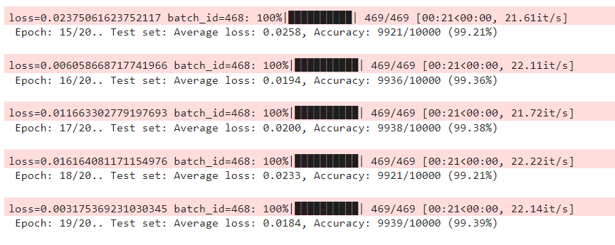

# **Session 3**
This folder contains the implementation of a backpropagation in Excel and neural network implementation in ipynb notebook. These are part of Session 6 Assignment.

# `Part1:`  Excel sheet showing backpropagation

The neural network consists of two layers: an input layer and an output layer. In this README, we will go through the steps involved in the calculations and provide the gradient calculations for each weight.

1. Calculate the activations of the hidden layer neurons:

    * `h1 = w1\*i1 + w2\*i2`

    * `h2 = w3\*i1 + w4\*i2`
2. Apply the sigmoid activation function to the hidden layer neurons:
    * `a_h1 = sigmoid(h1)`

    * `a_h2 = sigmoid(h2)`
3. Calculate the outputs of the neural network:
    * `o1 = w5\*a_h1 + w6\*a_h2 `

    * `o2 = w7\*a_h1 + w8\*a_h2`

4. Apply the sigmoid activation function to the output layer neurons:
    * `a_o1 = sigmoid(o1)`

    * `a_o2 = sigmoid(o2)`

    * `E1 = 1/2\*(t1-a_o1)^2`

    * `E2 = 1/2\*(t2-a_o2)^2`
5. Calculate the total error (E_total):
    * `E_total = E1 + E2`

    * `sigmoid(x)  = 1/(1+exp(-x))`

## Perform gradient calculations for backpropagation to update the weights:

1. Gradient of E_total wrt w5,w6,w7 and w8(Layer 2 Weights):
    * `ðE_t/ðw5 = (a_o1-t1) \* (a_o1 \*(1-a_01)) \* a_h1`

    * `ðE_t/ðw6 = (a_o1-t1) \* (a_o1 \*(1-a_01)) \* a_h2`

    * `ðE_t/ðw7 = (a_o2-t2) \* (a_o2 \*(1-a_02)) \* a_h1`

    * `ðE_t/ðw7 = (a_o2-t2) \* (a_o2 \*(1-a_02)) \* a_h2`

2.  Gradient of E_total wrt a_h1 and a_h2(Layer 1 activations)
    * `ðE_t/ða_h1 = ((a_o1-t1)\*(a_o1\*(1-a_o1))\*w5) + ((a_o2-t2)\*(a_o2\*(1-a_o2))\*w7)`

    * `ðE_t/ða_h2 = ((a_o1-t1)\*(a_o1\*(1-a_o1))\*w6) + ((a_o2-t2)\*(a_o2\*(1-a_o2))\*w8)`

3. Gradient of E_total wrt w1,w2,w3 and w4(Layer 1 Weights)
    * `ðE_t/ðw1 = (((a_o1-t1)\*(a_o1\*(1-a_o1))\*w5) + ((a_o2-t2)\*(a_o2\*(1-a_o2))\*w7)) \* a_h1\*(1-a_h1) \* i1`

    * `ðE_t/ðw2 = (((a_o1-t1)\*(a_o1\*(1-a_o1))\*w5) + ((a_o2-t2)\*(a_o2\*(1-a_o2))\*w7)) \* a_h1\*(1-a_h1) \* i2`

    * `ðE_t/ðw3 = (((a_o1-t1)\*(a_o1\*(1-a_o1))\*w6) + ((a_o2-t2)\*(a_o2\*(1-a_o2))\*w8)) \* a_h2\*(1-a_h2) \* i1 `

    * `ðE_t/ðw4 = (((a_o1-t1)\*(a_o1\*(1-a_o1))\*w6) + ((a_o2-t2)\*(a_o2\*(1-a_o2))\*w8)) \* a_h2\*(1-a_h2) \* i2 `

## Results 
### 1. lr = 0.1
**Error chart**

### 2. lr = 0.2
**Error chart**

### 3. lr = 0.5
**Error chart**

### 4. lr = 0.8
**Error chart**

### 5. lr = 1.0
**Error chart**

### 6. lr = 2.0
**Error chart**

# `Part2:` Neural Network in Notebook

## Final Model 

## Parameters
Total parameters:  **19,314**

## Best Test Accuracy
Achieved an accuracy of **99.39%**

