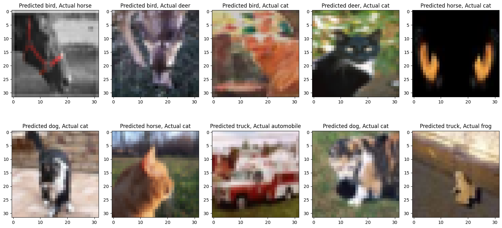
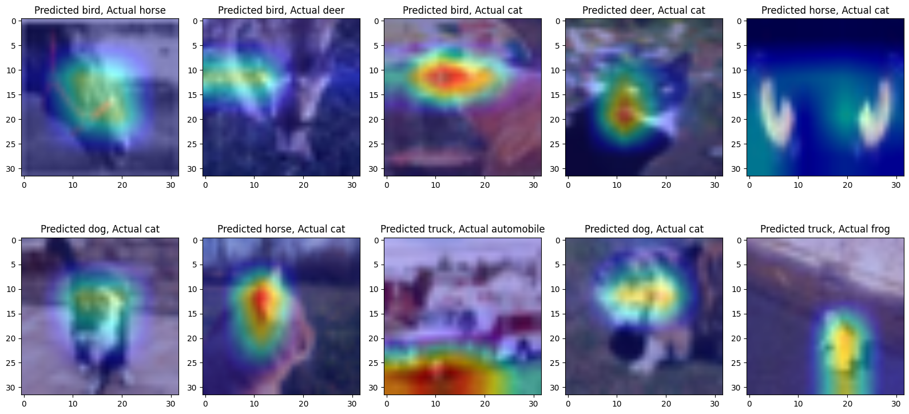
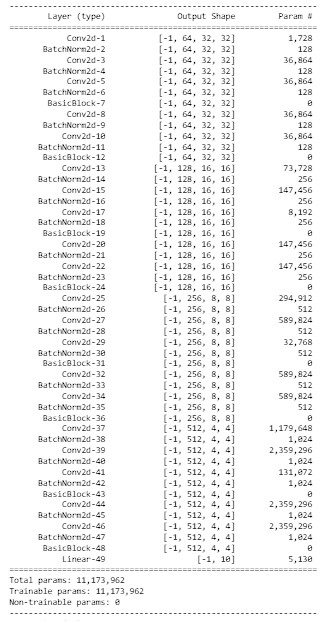

# ERAV1 SESSION 11 ASSIGNMENT

This folder contains 3 python notebook. Notebook uses albumenations data augmentation library to transform image and ResNet18 to train on CIFAR10 for 20 epochs

 
**Model**

ResNet18

**Target:** 

Use GradCam on the misclassified images

**Mis Classified Results:**

**Grad Cam Results:**

**Model Parameters**

