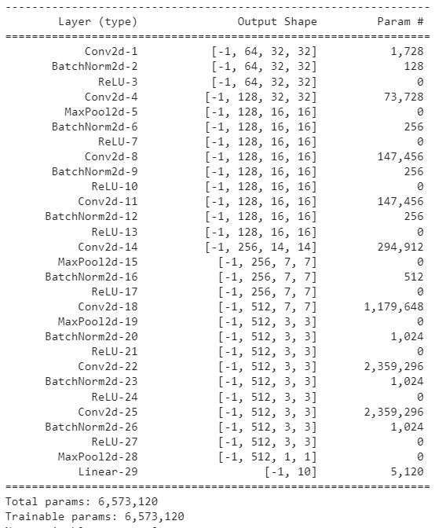
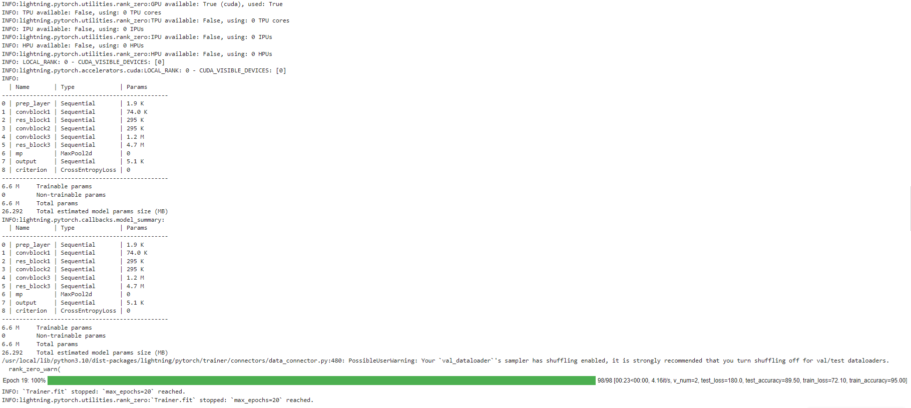
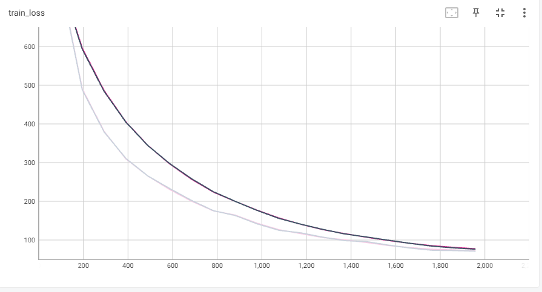
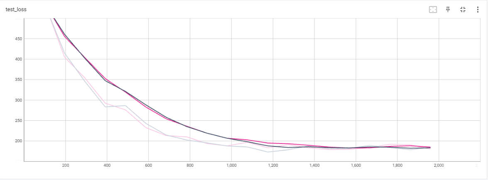
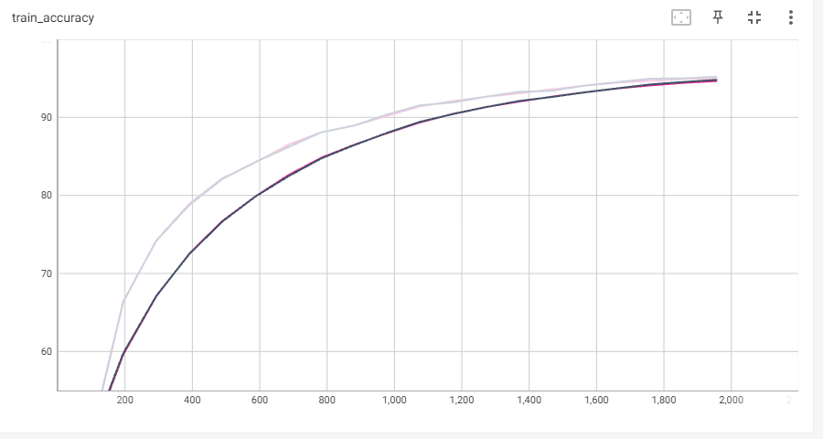
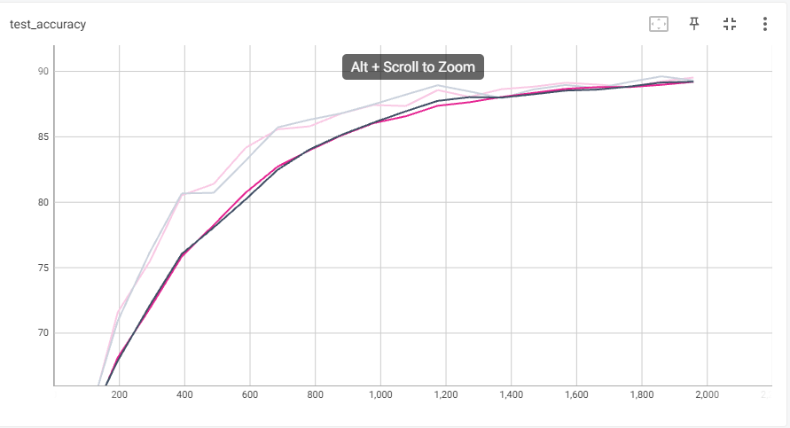
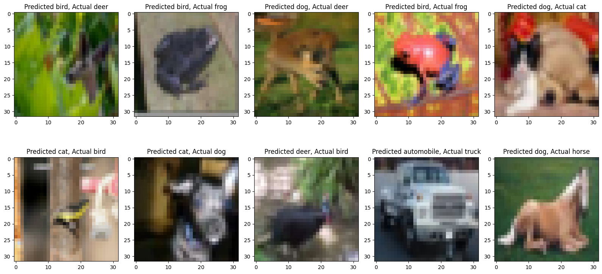
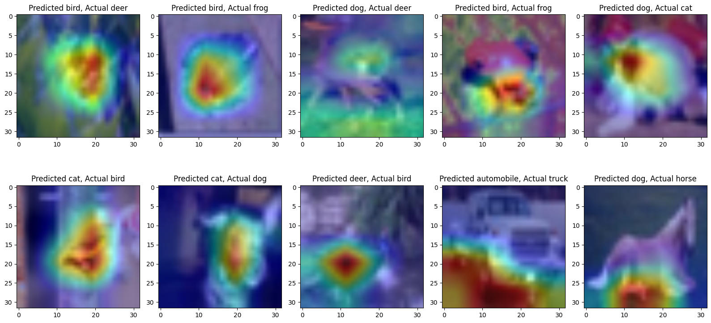

# Image Classifier App with CustomResNet, Gradio, and PyTorch Lightning

This repository showcases the development of an interactive image classifier application powered by a CustomResNet model, integrated with Gradio for user-friendly interactions and PyTorch Lightning for efficient training. The app offers features such as GradCAM visualization, misclassified image exploration, image upload with prediction, and displays top predicted classes.

## Summary

### Model Training and Lightning Integration

The CustomResNet model has been retrained using PyTorch Lightning, a powerful framework that streamlines the training process for enhanced efficiency and maintainability. 

### Gradio-Powered Interactive App

The app, created with Gradio, provides an intuitive interface with the following capabilities:

1. **GradCAM Visualization**: Visualize GradCAM outputs to identify influential regions in images. Adjust image count, opacity, and target layer for insights.

2. **Misclassified Image Exploration**: Investigate misclassified images by specifying the desired count.

3. **Image Upload and Prediction**: Upload images for classification. The app displays the top predicted classes (up to 10) along with their probabilities.

4. **Example Images**: Evaluate model performance quickly using 10 sample images from the CIFAR-10 dataset.

## Model Training Details

Below are sample training logs showcasing the progress and performance during model training:

## Model Training Logs

## Loss Function and Accuracy Graphs

The following graphs visualize the training and validation loss:

## Misclassified Images

Here are 10 sample misclassified images from the dataset:

## GradCam Images

Here are 10 sample GradCam images from the dataset:

For detailed logs, loss function graphs, and to explore misclassified images, refer to the [GitHub repository](https://github.com/ankode/ERAV1/tree/main/Session12).