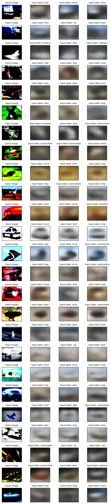

# Assignment Repository

This repository contains the code and outputs for the assignment as described below.

## Task 1: Training a UNet

### Objective
Train a UNet architecture with different variations and report the results.

### UNet Variations
1. UNet with MP+Tr+BCE Loss
2. UNet with MP+Tr+Dice Loss
3. UNet with StrConv+Tr+BCE Loss
4. UNet with StrConv+Ups+Dice Loss

## Task 2: Variation of a VAE

### Objective
Design a variation of a VAE and share results for MNIST and CIFAR10 datasets.

## Results
1. **MNIST Outputs**:
   

2. **CIFAR Outputs**:
   
