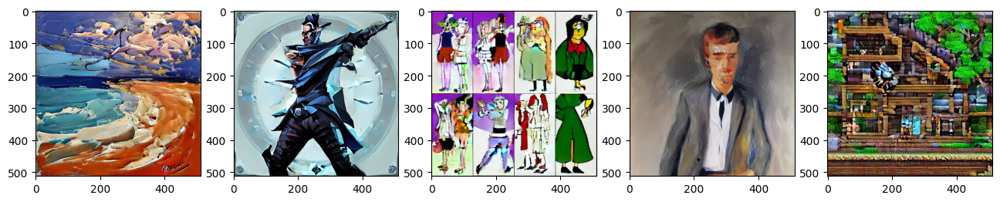
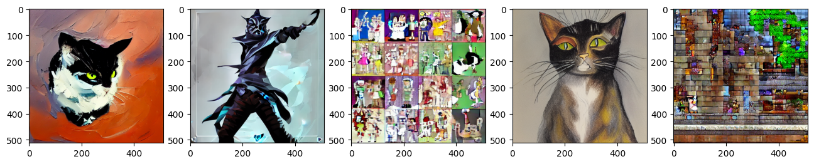
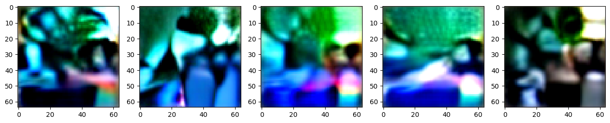

# Stable Diffusion Art Generator

The Stable Diffusion Art Generator is a creative tool that uses Stable Diffusion models to generate artistic images based on textual prompts and a selection of pretrained styles. This project combines text-based inputs and deep learning models to produce unique and visually captivating images.

## Features

- Generate Art from Text: Enter a textual prompt, and the generator will create art that matches your description.
- Pretrained Styles: Choose from a selection of pretrained styles, such as oil painting, valorant, cartoon, space, or terraria, to customize your generated images.
- Interactive Interface: The user-friendly interface allows you to experiment with different prompts and styles.

## Project Details
This project leverages Stable Diffusion models, including AutoencoderKL and LMSDiscreteScheduler, to generate artistic images. It incorporates the CLIPTextModel and CLIPTokenizer from Hugging Face's CLIP model for text processing and image generation.

## Prompt vs. Generated Images

 The following examples showcase how the generator brings text-based descriptions to  artwork:

### Prompt Example: "A Man in the Style of a Puppy"


### Prompt Example: "A Cat in the Style of a Puppy"


## Sepia-Style Loss

`sepia_loss` function applies a sepia tone effect. This effect adds nostalgia and artistic flair to generated artwork.

```
def sepia_loss(images):
    sepia_tone = 0.393 * images[:,0] + 0.769 * images[:,1] + 0.189 * images[:,2]
    error = torch.abs(sepia_tone - 0.5).mean()
    return error
```
### Loss based image Example: "A Cat in the Style of a Puppy"



## Hugging Face Space

Anyone can access and explore this project on Hugging Face Space and interact with the Stable Diffusion Art Generator, experiment with different prompts and styles

[Stable Diffusion Art Generator on Hugging Face Space](https://huggingface.co/spaces/ankoder/Generative_Art_and_Stable_Diffusion)

