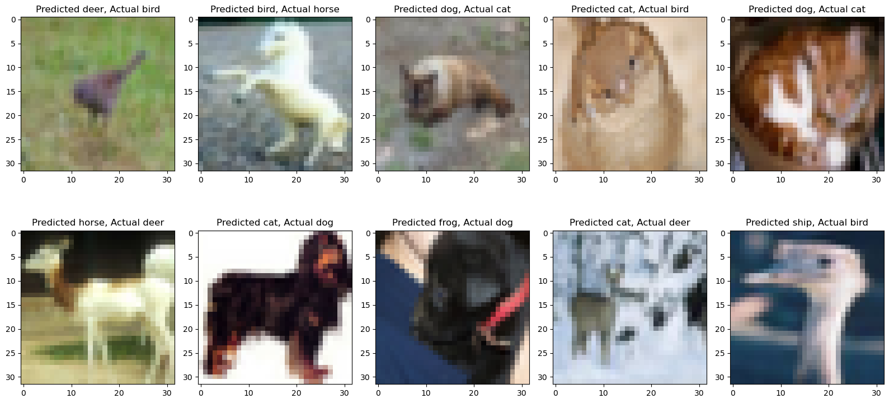
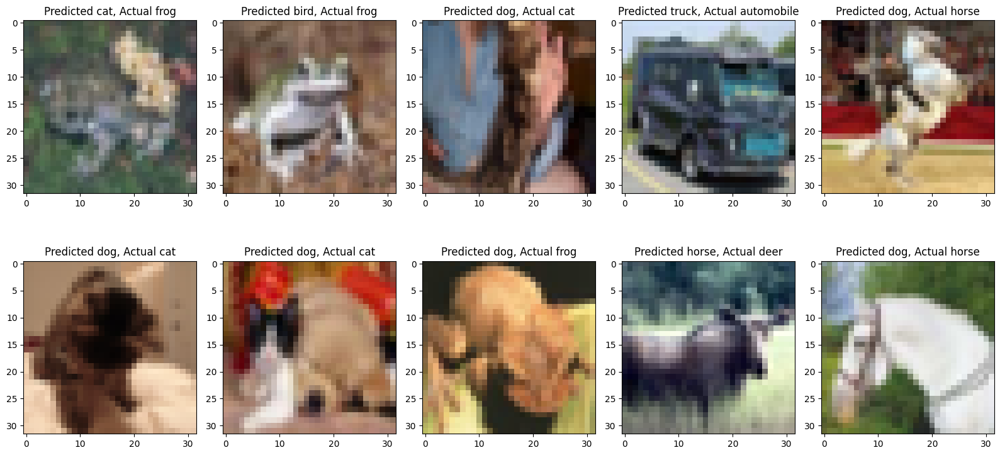
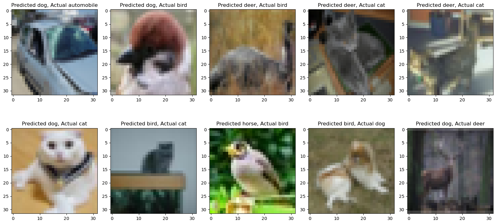

# ERAV1 SESSION 8 ASSIGNMENT

This folder contains 3 python notebook. Each notebook gets model from model.py named Model_4, Model_5, Model_6. These models uses different normalisation technique. This assignment is regarding the experimentation for the same.


 
## Model 1

**Target:** 
```
Uses Batch Normalisation
```

**Results:**
```
- Parameters: 37,576
- Best Train Accuracy: 71.17
- Best Test Accuracy: 71.35
```

**mis-classified  Images**



## Model 2

**Target:** 
```
Uses Group Normalisation

```

**Results:**
```
- Parameters: 37,576
- Best Train Accuracy: 68.54
- Best Test Accuracy: 67.75
```


**mis-classified  Images**



## Model 3

**Target:**
```
uses Layer Normalisation
```

**Results:**
```
- Parameters: 37,576
- Best Train Accuracy: 68.57
- Best Test Accuracy: 68.57
```


**mis-classified  Images**

