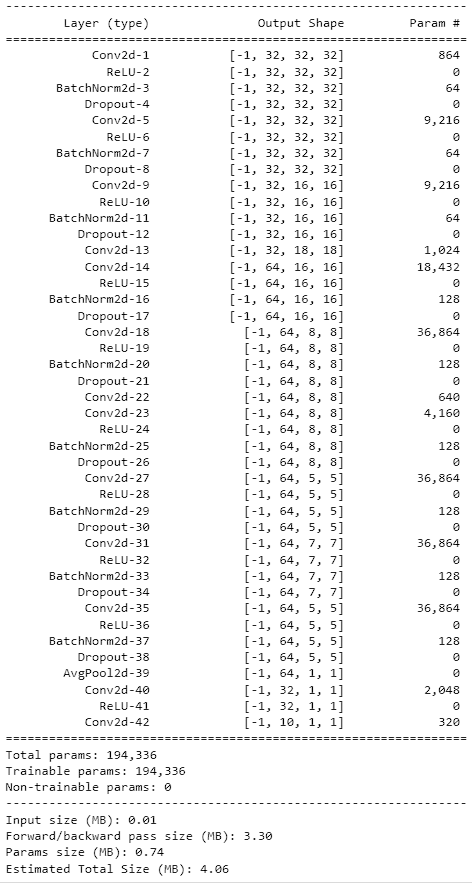

# ERAV1 SESSION 9 ASSIGNMENT

This folder contains 3 python notebook. Notebook uses albumenations data augmentation library to transform image.
Notebook also implements Dilation and Depthwise separable convolution.


 
## Model

**Target:** 
```
Use Data Augmentation along with Dilated Kernels and Depthwise Separable Convolution.
```

**Results:**
```
- Parameters: 194,336
- Best Train Accuracy: 79.66
- Best Test Accuracy: 85.40
- Epochs:
 - 20 : LR - 0.1
 - 10 : LR - 0.08
 - 10 : LR - 0.01
```

**Model Parameters**


